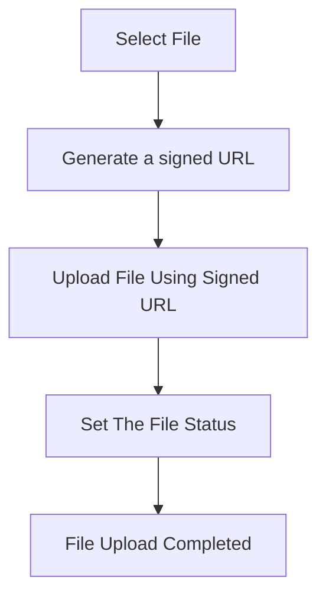

import { Callout, Tab, Tabs } from "nextra/components"

# File handling

ROQ SDK for BaaS provides a complete solution for file management, including these features:

- File management (create , read, update, and delete file).
- Files visibility (public or private).
- File categories.
- File upload.

## Basic concepts

<Callout type="info">
  Files uploaded to the ROQ Platform are stored on [Scaleway Object Storage](https://www.scaleway.com/en/object-storage/). The data center is located in Paris. 
</Callout>

The upload is realized using **signed URLs**, which means the files are uploaded directly from the user's browser to the object storage without sending it through your backend.

## File categories

File categories can be managed via API or ROQ Console. 

Using the `fileCategories()` and `fileCategory()` APIs from the ROQ Platform, we can retrieve a list of all registered file categories and their details, respectively. These APIs can be easily used on the client-side via front-end SDK.

### `fileCategories()`

Get all file categories.

<Tabs items={["TypeScript", "Response"]}>
<Tab>
```tsx
import { useRoqClient } from "/lib/roq"

const doReadCategories = async () => {
    const allCategories = await roqClient.roqPlatform.fileCategories({})
    return allCategories
}
```
</Tab>

<Tab>
The categories response: 

```json
{
    "fileCategories": {
        "data": [
            {
                "id": "ff8143f2-cd89-41e9-af16-999c9b9da9b8",
                "createdAt": "2023-10-19T07:23:12.812Z",
                "updatedAt": "2023-10-19T07:23:12.812Z",
                "key": "USER_FILES",
                "name": "Files for user",
                "maxSize": 20000000,
                "isPublicByDefault": true
            },
            {
                "id": "10b7a0fa-c7fa-41ba-b94c-1eda4daadb09",
                "createdAt": "2023-10-19T07:23:12.812Z",
                "updatedAt": "2023-10-19T07:23:12.812Z",
                "key": "CHAT_FILES",
                "name": "Chat Files",
                "maxSize": 50000000,
                "isPublicByDefault": true
            },
            {
                "id": "de7194de-9857-4645-9e7b-56f95542340a",
                "createdAt": "2023-10-19T07:23:12.812Z",
                "updatedAt": "2023-10-19T07:23:12.812Z",
                "key": "USER_AVATAR_FILES",
                "name": "Avatar of user",
                "maxSize": 10000000,
                "isPublicByDefault": true
            }
        ],
        "totalCount": 3
    }
}
```
</Tab>
</Tabs>

### `fileCategory()`

Get file category details.

<Tabs items={["TypeScript", "Response"]}>
<Tab>
```tsx
const categoryDetails =async () => {
    const categoryDetail = await roqClient.roqPlatform.fileCategory({
		    id: "ff8143f2-cd89-41e9-af16-999c9b9da9b8",
				withFileCategoryContentGroups: true
		})
    return categoryDetail
}
```
</Tab>
<Tab>
The category details response:

```json
{
    "fileCategory": {
        "id": "ff8143f2-cd89-41e9-af16-999c9b9da9b8",
        "createdAt": "2023-10-19T07:23:12.812Z",
        "updatedAt": "2023-10-19T07:23:12.812Z",
        "key": "USER_FILES",
        "name": "Files for user",
        "maxSize": 20000000,
        "isPublicByDefault": true,
        "fileCategoryContentGroups": {
            "data": [
                {
                    "id": "555e422d-63b0-4f16-bdbe-8b5a41423444",
                    "createdAt": "2023-03-30T09:47:06.957Z",
                    "updatedAt": "2023-03-30T09:47:06.957Z",
                    "key": "image",
                    "name": "Image"
                },
                {
                    "id": "83939f1f-057e-424b-ad16-748d4bc5e006",
                    "createdAt": "2023-03-30T09:47:06.957Z",
                    "updatedAt": "2023-03-30T09:47:06.957Z",
                    "key": "application",
                    "name": "Application"
                },
                {
                    "id": "1150e947-a2d3-4702-ba3c-73d3b173bc33",
                    "createdAt": "2023-03-30T09:47:06.957Z",
                    "updatedAt": "2023-03-30T09:47:06.957Z",
                    "key": "text",
                    "name": "Text"
                },
                {
                    "id": "db505acd-0112-4378-92db-7694e17c4bdb",
                    "createdAt": "2023-03-30T09:47:06.957Z",
                    "updatedAt": "2023-03-30T09:47:06.957Z",
                    "key": "video",
                    "name": "Video"
                },
                {
                    "id": "aa70bc75-d6a7-4f76-8e91-8cccc38d570c",
                    "createdAt": "2023-03-30T09:47:06.957Z",
                    "updatedAt": "2023-03-30T09:47:06.957Z",
                    "key": "message",
                    "name": "Message"
                },
                {
                    "id": "df711f31-1c7e-4204-b7fc-759307f64ec3",
                    "createdAt": "2023-03-30T09:47:06.957Z",
                    "updatedAt": "2023-03-30T09:47:06.957Z",
                    "key": "audio",
                    "name": "Audio"
                },
                {
                    "id": "3327d8d3-2d7e-40f9-b507-2bcf160df480",
                    "createdAt": "2023-03-30T09:47:06.957Z",
                    "updatedAt": "2023-03-30T09:47:06.957Z",
                    "key": "font",
                    "name": "Font"
                },
                {
                    "id": "6d6b2413-309e-4ee8-9a14-8138f95b0816",
                    "createdAt": "2023-03-30T09:47:06.957Z",
                    "updatedAt": "2023-03-30T09:47:06.957Z",
                    "key": "multipart",
                    "name": "Multipart"
                },
                {
                    "id": "085d98ac-cc9a-4092-9c91-f2d1a0eb6978",
                    "createdAt": "2023-03-30T09:47:06.957Z",
                    "updatedAt": "2023-03-30T09:47:06.957Z",
                    "key": "model",
                    "name": "Model"
                },
                {
                    "id": "7ae85adf-f2fb-47b1-9f5f-2d8fb1900faf",
                    "createdAt": "2023-03-30T09:47:06.957Z",
                    "updatedAt": "2023-03-30T09:47:06.957Z",
                    "key": "other",
                    "name": "Other"
                }
            ],
            "totalCount": 10
        }
    }
}
```
</Tab>

</Tabs>


## File visibility

A file can be either public or private. Public means that there is a permanent URL that anyone can use, while private files can only be accessed by users who are allowed to do so. The visibility of a file can be changed in ROQ Console or API.

{/* Code examples */}

## File management

File management from a Backend-as-a-Service (BaaS) perspective involves providing client applications with APIs and services to handle, store, retrieve, and manipulate files on remote servers without the need for developers to build and maintain their backend infrastructure. ROQ SDK for BaaS provides all these functionality whether through API or ROQ Console.


### File creation

### File reading

### File updating

### File deletion


## Upload files

