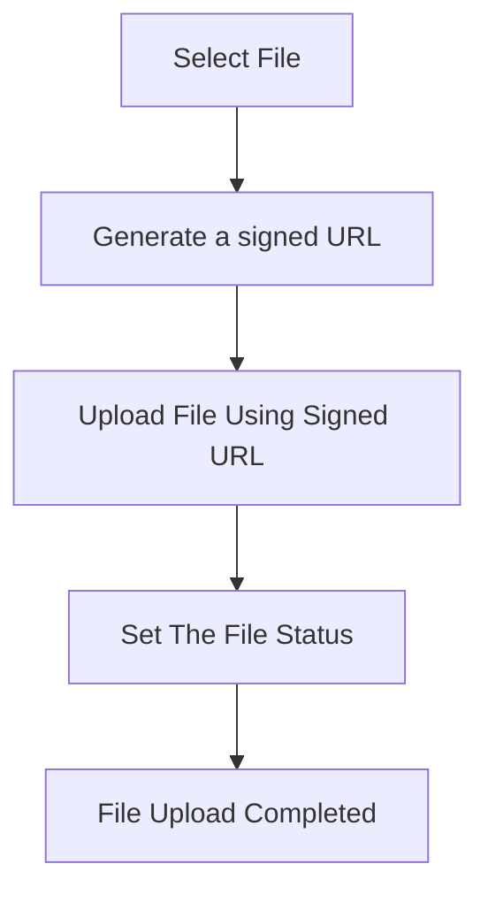

import { Callout } from 'nextra/components'

# Overview

### Uploading and storing files

For file upload, the upload is realized using **signed URLs**, which means the files are uploaded directly from the user's browser to the object storage without sending it through your backend.

<Callout type="info">
  Files uploaded to the ROQ Platform are stored on [Scaleway Object Storage](https://www.scaleway.com/en/object-storage/). The data center is located in Paris. 
</Callout>

{/*Another description,steps and code*/}

### File management and access control
