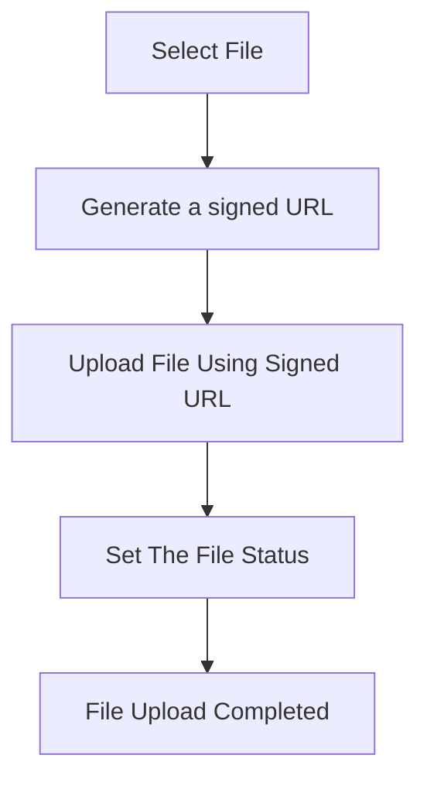

# Uploading files

The file upload process flow is outlined as a series of steps below:

1. The user selects a file (HTML5 Form, React Component, etc).
2. The system generates a **signed URL** using the `createFileUpload()` method.
3. The file is uploaded directly using the provided **signed URL** which means the files are uploaded directly from the user's browser to the object storage without sending it through your backend.
4. After the upload completes, the file status is set using the `updateFileStatus()` method.
5. The file upload process is then marked as completed.

