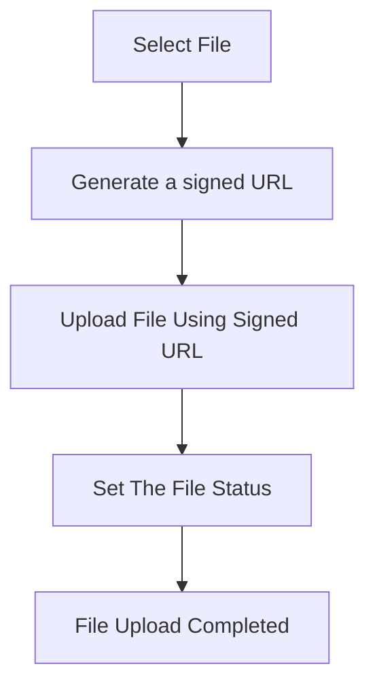

import { Steps, Tabs, Tab }  from "nextra/components"

# Uploading files



The file upload process flow is outlined as a series of steps below:

<Steps>
### Select file
    
    The user initiates file upload by selecting a file. The file selection can be done using HTML5 Form, React Component, etc. It depends on the developer's implementation of file uploading.

    We can use a simple React form for simple file selection input:

    ```tsx
    function FileUpload() {

        const handleFileChange =async (event) => {
            const file = event.target.files[0]
        }

        return (
            <div>
                <h1>Upload a File</h1>
                <input type="file" onChange={handleFileChange} accept="image/jpeg, image/png" />
            </div>
        )
    }
    ```

### Generates a signed URL

    The `createFileUpload()` method will return a signed URL. This URL is needed for uploading the file later.

<Tabs items={["TypeScript", "Responses"]}>
<Tab>
```tsx
const handleFileChange = async (event) => {
    const file = event.target.files[0]

    try {
        const response = await client.asSuperAdmin().createFileUpload({
            createFileDto: {
                name: file.name,
                contentType: file.type,
                fileCategory: 'USER_FILES',
            },
            const { uploadUrl } = response.createFileUpload
        }) catch (err) {
            conssole.log(err)
        }
    }
}    
```
</Tab>
<Tab>
```json
{
    "createFileUpload": {
        "contentType": "image/png",
        "createdAt": "2023-10-29T22:08:14.339Z",
        "createdByUserId": "8b249b07-bdd9-43f7-a10e-ace10f27ff66",
        "fileCategoryId": "ff8143f2-cd89-41e9-af16-999c9b9da9b8",
        "formFields": {
            "maxSize": "20000000",
            "Content-Type": "image/png",
            "expiryTime": "3600",
            "bucket": "e3408733-0ac2-4596-8264-0a7da2481801-environment-bucket",
            "X-Amz-Algorithm": "AWS4-HMAC-SHA256",
            "X-Amz-Credential": "SCWFDYNVPNED1G3YVV8N/20231029/fr-par/s3/aws4_request",
            "X-Amz-Date": "20231029T220814Z",
            "key": "2.png",
            "Policy": "eyJleHBpcmF0aW9uIjoiMjAyMy0xMC0yOVQyMzowODoxNFoiLCJjb25kaXRpb25z",
            "X-Amz-Signature": "edef924967e3f77d72d3eaf53563a1c7a67423d5a1d37d7114205f178c1fe4f5"
        },
        "id": "dd1f3ac5-2951-460e-add3-d3ef9516d694",
        "isPublic": true,
        "name": "2.png",
        "status": "upload_pending",
        "updatedAt": "2023-10-29T22:08:14.339Z",
        "uploadUrl": "https://s3.fr-par.scw.cloud/e3408733-0ac2-0a7da2481801-environment-bucket"
    }
}
```
</Tab> 
</Tabs>

### Upload file using signed URL 

    The file will be uploaded using the provided **signed URL**, which means it is uploaded directly from the user's browser to the object storage without sending it through your backend.

    Let's take an example, uploading a file using `axios`:

```tsx
const { uploadUrl, formFields, id } = response.createFileUpload
const formData = new FormData()

for (let [key, value] of Object.entries(formFields || {})) {
    formData.append(key, value);
}

formData.append('file', file)

try {
    const response = await axios.post(uploadUrl, formData, {
        headers: {
            'content-type': null,
        },
    });

    if (response.status >= 200 && response.status < 300) {

        // Add set file status here
        
        console.log('Upload successful!', response.data);
    } else {
        console.error('Server responded with an error', response.data);
    }
} catch (error) {
    console.error('Error uploading file:', error);
} 
```

The critical thing to note here is that the `formFields` returned by the `createFileUpload()` should also be passed to `formData`.

```tsx
for (let [key, value] of Object.entries(formFields || {})) {
    formData.append(key, value);
}
```

### Set the file status 

    Set the status of the file using the `updateFileStatus()` API. When the upload is finished, you need to set the upload status. This is required because the file is uploaded directly to the object storage, bypassing the ROQ Platform.

```tsx
await roqClient.roqPlatform.updateFileStatus({
    id: id,
    status: FileStatusEnum.Ready,
})
```

### File upload completed

With the completed file upload then we can check the file using the `file()` method.


<Tabs items={["TypeScript", "Response"]}>
<Tab>
```tsx
const filebyId =async () => {
	const myfile = await roqClient.roqPlatform.file({
		id: "dd1f3ac5-2951-460e-add3-d3ef9516d694",
		withCreatedByUser: true
	})
}
```
</Tab>
<Tab>
```json {11}
{
    "file": {
        "id": "dd1f3ac5-2951-460e-add3-d3ef9516d694",
        "createdAt": "2023-10-29T22:08:14.339Z",
        "updatedAt": "2023-10-29T22:08:43.053Z",
        "contentType": "image/png",
        "createdByUserId": "8b249b07-bdd9-43f7-a10e-ace10f27ff66",
        "fileCategoryId": "ff8143f2-cd89-41e9-af16-999c9b9da9b8",
        "isPublic": true,
        "name": "2.png",
        "status": "ready",
        "url": "https://s3.fr-par.scw.cloud/e3408733-0ac2-4596-8264-0a7da2481801-environment-bucket/2.png",
        "createdByUser": {
            "id": "8b249b07-bdd9-43f7-a10e-ace10f27ff66",
            "reference": "8b249b07-bdd9-43f7-a10e-ace10f27ff66",
            "firstName": "",
            "lastName": "",
            "active": true,
            "email": "Francis84@roq.tech",
            "phone": null,
            "locale": "en-US",
            "isOptedIn": true,
            "synced": false,
            "tenantId": "dc92f95d-42bd-45af-84a7-da227d694cbb",
            "customData": {},
            "timezone": "Asia/Jakarta",
            "avatarUrl": "",
            "createdAt": "2023-10-19T09:46:17.157Z",
            "updatedAt": "2023-10-19T09:46:17.368Z"
        }
    }
}
```
</Tab>
</Tabs>

</Steps>
