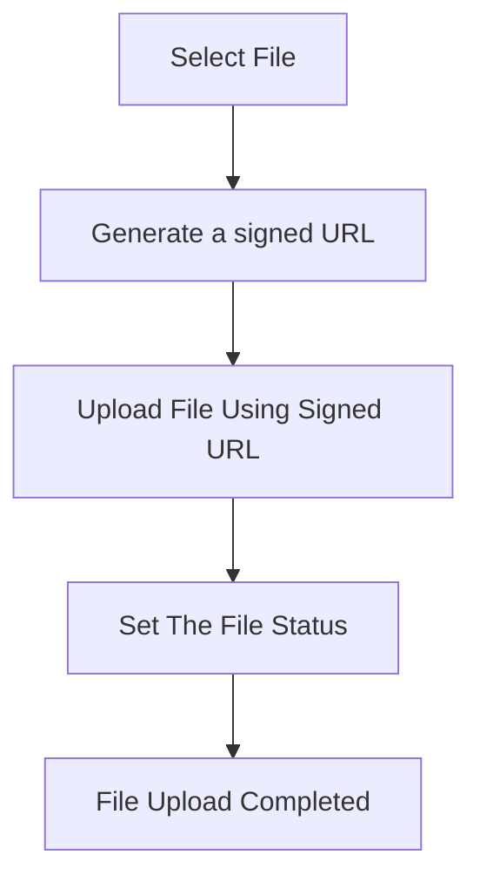

import { Steps }  from "nextra/components"

# Uploading files

The file upload process flow is outlined as a series of steps below:

<Steps>
### Select file
	
	User initiate file upload with selecting a file. The file selection can be done using HTML5 Form, React Component, etc. It depends on the developer implementation for file uploading.

### Generates a signed URL

    The `createFileUpload()` method will return a signed URL. This URL is needed for uploading the file later. 

### Upload file usinf signed URL 

    File will be uploading using the provided **signed URL** which means the files are uploaded directly from the user's browser to the object storage without sending it through your backend.

### Set the file status 

    Set the status of the file using the `updateFileStatus()` API. When the upload is finished, you need to set the upload status. This is required because the file is uploaded directly to the object storage, bypassing the ROQ Platform.

### File upload completed
</Steps>
