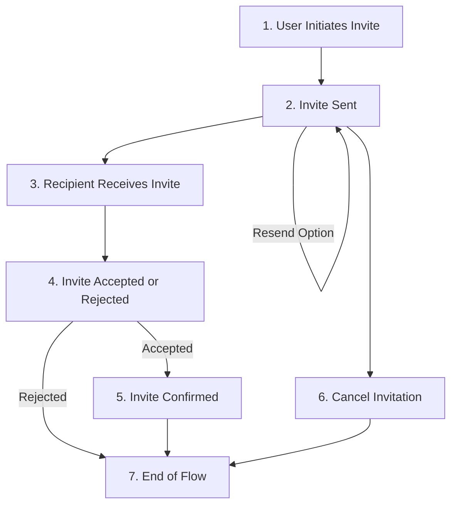

import { Callout } from 'nextra/components'

# Add user invites

## Invitation process overview




The invitation process flow is outlined as a series of steps below:

1. **User Initiates Invite:** The process starts with a user's decision to send an invitation.
2. **Invite Sent:** The system activates this method, managing the dispatch of the invitation.
3. **Recipient Receives Invite:** The invitee gets a notification, typically via email or another communication channel.
4. **Invite Accepted or Rejected:** The recipient can choose to either accept or decline the invitation.
5. **Invite Confirmed:** If accepted, the system verifies the invitation, potentially involving further setup for the invitee.
6. **Cancel Invitation:** At any point after sending the invite and before its acceptance, the inviter can opt to cancel the invitation.
7. **End of Flow:** The process wraps up, either with the invitee successfully onboarded, the invitation declined, or the invitation canceled.

{/*Description is here*/}

## Querying the user invitation list

You can get all the user invites list using this `userInvites()` method API. You can limit the results and search the invitee by email, name, or keywords, etc.

For example, in the Next.js page, to get the the invitee list with the limit 10:

```tsx
import { useRoqClient } from '@roq/nextjs'

const roqClient = useRoqClient()

const userInvitesData = await roqClient.roqPlatform.userInvites({
  limit: 10
})
```

<Callout type="info">
Please note that the `userInvites()` method is part of the ROQ platform API and cannot be generated. However, you can also cancel the invitation in the ROQ Console. You can read the documentation of the `userInvites()` API [here](https://jupiter-pp.roq-platform.com/docs/#query-userInvites).
</Callout>