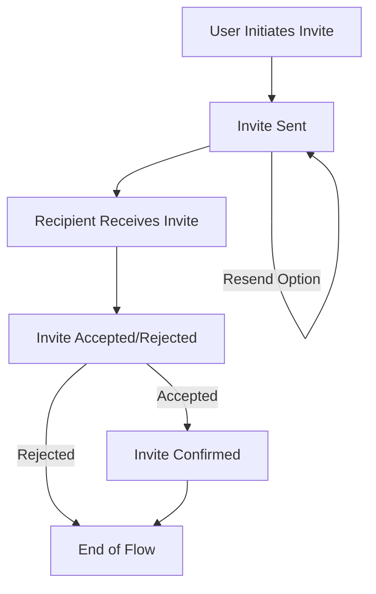

import { Callout } from 'nextra/components'

# Add user invites


## Invites flow 



{/*Description is here*/}


## Invites query

You can get all the user invites list using this `userInvites()` method API. You can limit the results and search the invitee by email, name, or keywords, etc.

For example, in the Next.js page, to get the the invitee list with the limit 10:

```tsx
import { useRoqClient } from '@roq/nextjs'

const roqClient = useRoqClient()

const userInvitesData = await roqClient.roqPlatform.userInvites({
  limit: 10
})
```

<Callout type="info">
Please note that the `userInvites()` method is part of the ROQ platform API and cannot be generated. However, you can also cancel the invitation in the ROQ Console. You can read the documentation of the `userInvites()` API [here](https://jupiter-pp.roq-platform.com/docs/#query-userInvites).
</Callout>