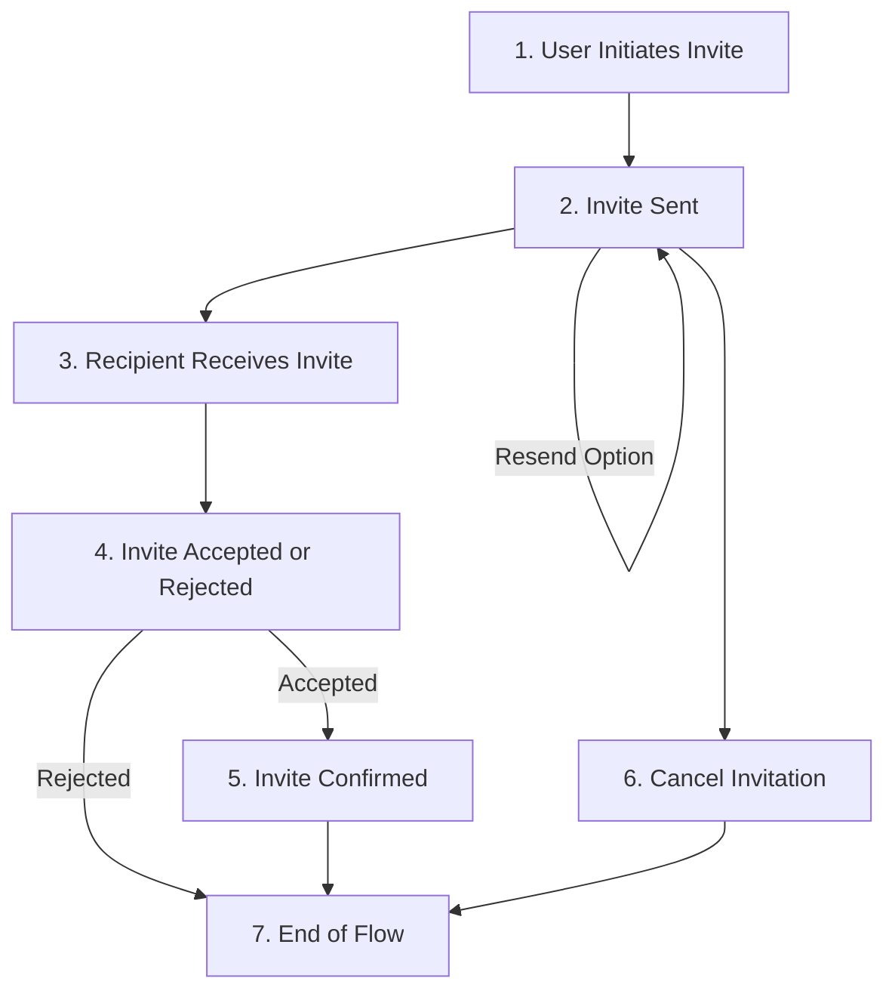

import { Callout, Steps } from 'nextra/components'

# Add user invites

## Invitation process overview




The invitation process flow is outlined as a series of steps below:

<Steps>
### User Initiates Invite 

The process starts with a user's decision to send an invitation. To send any invitation later, we should know which user is sending the invitation and the tenant. 

In Next.js, we can get the user data from the session:

```tsx
import { useSession } from "@roq/next.js"

const { session } = useSession()

const roq_user_id = session.roqUserId
const tenant_id = session.user.tenantId
```

Another way we can query these data is using the `findMany()` on the `user` entity. For example, we can find a user based on the email:

```tsx
const getUserData = async () => {
  const userData = await roqClient.user.findMany({
    where: {
      email: {
        equals: "t.justin@roq.tech"
      }
    }
  })
}
```

From the code, we can get the response as an object:

```tsx
[
    {
        "id": "2aef5b13-b647-4ff4-b76f-a58d62cdb0ef",
        "email": "Francis43@roq.tech",
        "firstName": null,
        "lastName": null,
        "roq_user_id": "06077069-4193-4f2d-98e1-2c1354df9ba6",
        "tenant_id": "dc92f95d-42bd-45af-84a7-da227d694cbb",
        "created_at": "2023-10-19T09:46:27.664Z",
        "updated_at": "2023-10-19T09:46:27.664Z"
    }
]
```

We will use the `roq_user_id` and `tenant_id` data for the next step, which is sent invitation. By default, the role of the invitee is the same as the user who's sent the invitation.

### Invite Sent

The `sendUserInvites()` API invites users and automatically creates a user invite.

```tsx
const status = async() => {
  await roqClient.roqPlatform.sendUserInvites({
    userInvites: {
      tenantId: 'dc92f95d-42bd-45af-84a7-da227d694cbb',
      userInvites: [{
        createdByUserId: '8b249b07-bdd9-43f7-a10e-ace10f27ff66',
        email: "wick.john@roq.tech",
        locale: "en-US"
      }]
    }
  })
} 
```
If the user invitation is a success, we will get the response data:

```json
{
    "sendUserInvites": {
        "success": [
            {
                "acceptedByUserId": null,
                "createdAt": "2023-10-27T00:14:36.900Z",
                "createdByUserId": "8b249b07-bdd9-43f7-a10e-ace10f27ff66",
                "data": null,
                "email": "wick.john@roq.tech",
                "firstName": "",
                "id": "db7a682d-6dca-4259-b15b-83aef12d1f5c",
                "locale": "en-US",
                "lastName": "",
                "roleKeys": null,
                "status": "pending",
                "statusUpdatedAt": "2022-08-10T09:02:18.579Z",
                "tenantId": "dc92f95d-42bd-45af-84a7-da227d694cbb",
                "updatedAt": "2023-10-27T00:14:36.900Z",
                "userTokenId": "e9ff1946-6060-4917-911b-c571cd98466a"
            }
        ],
        "errors": []
    }
}
```

In case we want to resend the invitation, we can use the ID from the `sendUserInvites()` response and then resend the user invitation using the `resendUserInvite()` API.

```tsx
const resendUserInvitationStatus = async() => {
    const userInviteModel = await roqClient.roqPlatform.resendUserInvite({
        userInviteId: "db7a682d-6dca-4259-b15b-83aef12d1f5c"
    })
}
```

{/*

```json
{
    "resendUserInvite": {
        "acceptedByUserId": null,
        "createdAt": "2023-10-27T00:14:36.900Z",
        "createdByUserId": "8b249b07-bdd9-43f7-a10e-ace10f27ff66",
        "data": null,
        "email": "wick.john@roq.tech",
        "firstName": "",
        "id": "db7a682d-6dca-4259-b15b-83aef12d1f5c",
        "locale": "en-US",
        "lastName": "",
        "roleKeys": [],
        "status": "pending",
        "statusUpdatedAt": "2022-08-10T09:02:18.579Z",
        "tenantId": "dc92f95d-42bd-45af-84a7-da227d694cbb",
        "updatedAt": "2023-10-27T00:14:36.900Z",
        "userTokenId": "e9ff1946-6060-4917-911b-c571cd98466a"
    }
}
```
*/}

In Next.js, it is easy to implement a form that allows users to invite others via email:

```tsx filename="invite.tsx"
import { useState } from 'react'
import { useRoqClient } from '@/lib/roq'
import { useSession } from '@roq/nextjs'

export default function InvitePage() {
  const { session } = useSession();
  const [email, setEmail] = useState('')
  const [statusMessage, setStatusMessage] = useState('')

  const roqClient = useRoqClient()

  const handleInvite = async () => {
    if (session?.roqUserId && session?.user?.tenantId) {
      await roqClient.roqPlatform.sendUserInvites({
        userInvites: {
          tenantId: session.user.tenantId,
          userInvites: [{
            createdByUserId: session.roqUserId,
            email: email,
            locale: "en-US"
          }]
        }
      });
      setStatusMessage(`Invite sent to ${email}`)
    } else {
      setStatusMessage(`Unable to fetch session details.`)
    }
  };

  return (
    <div>
      <h1>Send an Invitation</h1>
      <input 
        type="email" 
        placeholder="Enter email to invite" 
        value={email}
        onChange={(e) => setEmail(e.target.value)}
      />
      <button onClick={handleInvite}>Send Invite</button>
      {statusMessage && <p>{statusMessage}</p>}
    </div>
  );
}
```

### Recipient Receives Invite

The invitee gets a notification by email.


### Invite Accepted or Rejected

The recipient can choose to either accept or decline the invitation and then we can check the invitation status using the `userInvites()` API.

```tsx
import { useRoqClient } from '@roq/nextjs'

const roqClient = useRoqClient()

const findUserInvitebyEmail = async() => {
    const inviteeData = await roqClient.roqPlatform.userInvites({
        filter: {
            email: {
                equalTo: "wick.john@roq.tech"
            }
        }
    })
    return inviteeData
}
```

If the invitee accepts the invitation, the response `status` will have an `accepted` value:

```json
{
    "userInvites": {
        "data": [
            {
                "acceptedByUserId": "9a2f96fa-6313-4b97-9de8-d735a0365d2e",
                "createdAt": "2023-10-27T00:14:36.900Z",
                "createdByUserId": "8b249b07-bdd9-43f7-a10e-ace10f27ff66",
                "data": null,
                "email": "wick.john@roq.tech",
                "firstName": "",
                "id": "db7a682d-6dca-4259-b15b-83aef12d1f5c",
                "locale": "en-US",
                "lastName": "",
                "roleKeys": [],
                "status": "accepted",
                "statusUpdatedAt": "2023-10-27T03:27:02.343Z",
                "tenantId": "dc92f95d-42bd-45af-84a7-da227d694cbb",
                "updatedAt": "2023-10-27T03:27:03.202Z",
                "userTokenId": "e9ff1946-6060-4917-911b-c571cd98466a"
            }
        ],
        "totalCount": 1
    }
}
```

In this Next.js page, we will use it for a single email use case. To support more emails, we need a better solution for auto status checking rather than polling.

```tsx filename="invite.tsx"
import { useState, useEffect } from 'react'
import { useRoqClient } from '@/lib/roq'
import { useSession } from '@roq/nextjs'

export default function InvitePage() {
  const { session } = useSession()
  const [email, setEmail] = useState('')
  const [statusMessage, setStatusMessage] = useState('')
  const [inviteStatus, setInviteStatus] = useState('pending')
  const POLL_INTERVAL = 5000 // Polling every 5 seconds

  const roqClient = useRoqClient()

  useEffect(() => {
    const pollInviteStatus = setInterval(async () => {
      if (email) {
        const inviteeData = await roqClient.roqPlatform.userInvites({
          filter: {
            email: {
              equalTo: email
            }
          }
        });
  
        if (inviteeData && inviteeData.data && inviteeData.data.length) {
          setInviteStatus(inviteeData.data[0].status);
        }
      }
    }, POLL_INTERVAL);

    return () => clearInterval(pollInviteStatus);
  }, [email]);

  const handleInvite = async () => {
    if (session?.roqUserId && session?.user?.tenantId) {
      await roqClient.roqPlatform.sendUserInvites({
        userInvites: {
          tenantId: session.user.tenantId,
          userInvites: [{
            createdByUserId: session.roqUserId,
            email: email,
            locale: "en-US"
          }]
        }
      });
      setStatusMessage(`Invite sent to ${email}`);
    } else {
      setStatusMessage(`Unable to fetch session details.`);
    }
  };

  return (
    <div>
      <h1>Send an Invitation</h1>
      <input 
        type="email" 
        placeholder="Enter email to invite" 
        value={email}
        onChange={(e) => setEmail(e.target.value)}
      />
      <button onClick={handleInvite}>Send Invite</button>
      {statusMessage && <p>{statusMessage}</p>}
      <p>Invitation Status: {inviteStatus}</p>
    </div>
  )
}
```

### Invite Confirmed

If accepted, the system verifies the invitation, potentially involving further setup for the invitee.

### Cancel Invitation

At any point after sending the invite and before its acceptance, the inviter can opt to cancel the invitation.
We can use `cancelUserInvite()` to cancel a user invitation.

```tsx
const cancleInvitation = async() => {
    const cancelStatus = await roqClient.roqPlatform.cancelUserInvite({
        userInviteId: "db7a682d-6dca-4259-b15b-83aef12d1f5c"
    })
    return cancelStatus
}
```

### End of Flow

The process wraps up either with the invitee successfully onboarded, the invitation declined, or the invitation canceled.

</Steps>


<Callout type="info">
Please note that the user invites API is part of the ROQ platform API and cannot be generated. You can read the documentation about the API [here](/user-invites/api).
</Callout>
