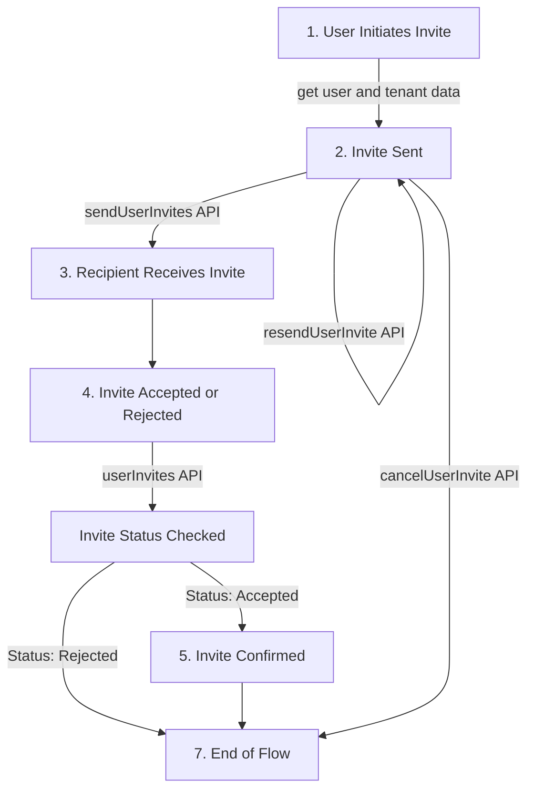

# How to add user invites to apps

We can add user invites feature to applications using the user invites API provided by ROQ BaaS SDK. The invitation process flow with the user invites API can be described as follows:



## Get user and tenant data

Before send the invitation, we need to get the user and tenant data. The user data can be retrieved using the `useSession()` method, which returns the user id and user tenanta data from the session.

For example in ROQ BaaS for Next.js:

```ts
import { useSession } from "@roq/nextjs"

const { session } = useSession()

const userId = session?.roqUserId
const tenantId = session?.user?.tenantId
```
