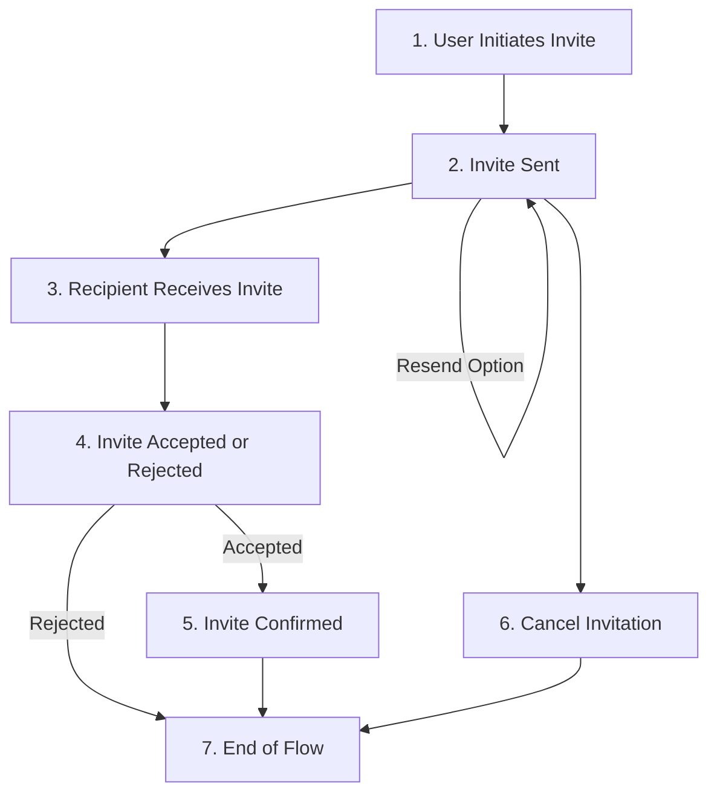

# Overview

## Introduction

In SaaS applications, it is common for users to invite others from their organization, also known as "**tenants**", especially when there is a charge for each user. This process is known as **tenant onboarding** or **user onboarding**. The process of inviting users to your application is a critical part of the user experience. It is important to get it right, as it can have a significant impact on the success of your application.

## Invitation process overview

The user invitation process is outlined in the diagram below:

The invitation process from the diagram above can be broken down into the following steps:

1. **User Initiates Invite:** The process starts with a user's decision to send an invitation.
2. **Invite Sent:** The system activates this method, managing the dispatch of the invitation.
3. **Recipient Receives Invite:** The invitee gets a notification, typically via email or another communication channel.
4. **Invite Accepted or Rejected:** The recipient can choose to either accept or decline the invitation.
5. **Invite Confirmed:** If accepted, the system verifies the invitation, potentially involving further setup for the invitee.
6. **Cancel Invitation:** At any point after sending the invite and before its acceptance, the inviter can opt to cancel the invitation.
7. **End of Flow:** The process wraps up either with the invitee successfully onboarded, the invitation declined, or the invitation canceled.

## Inviting new users to your application

## Invitation management and tracking

## API

## How to use the SDK

