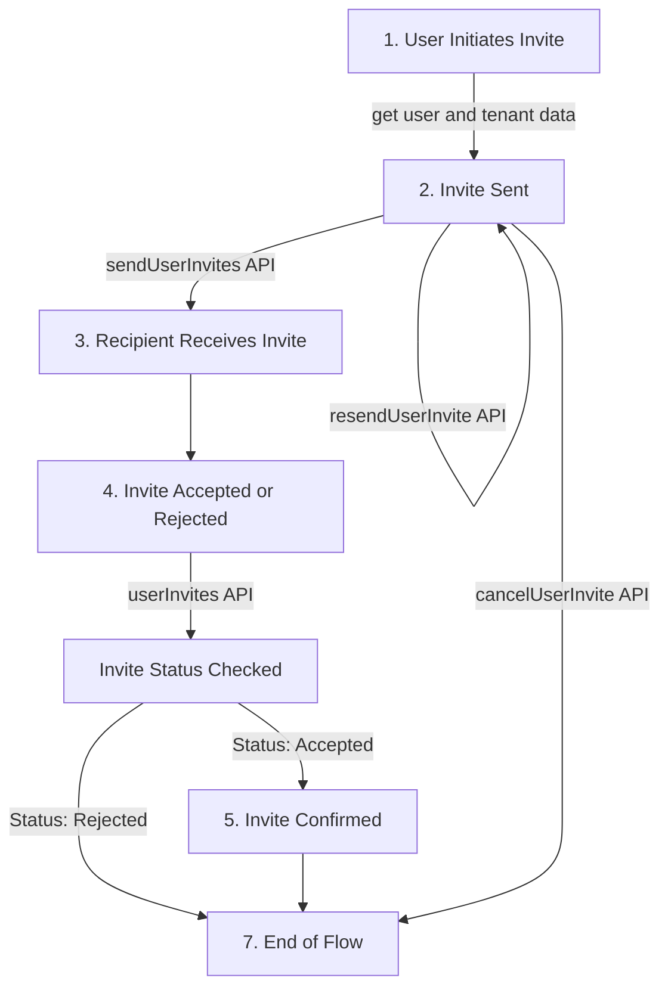

# Overview

## Introduction

In SaaS applications, it is common for users to invite others from their organization, also known as **tenants**. This process is known as **user onboarding**.

## User invite process flow

Before inviting any user, we should be familiar with the user invitation process flow. The user invitation process can be outlined as the diagram below:

Moreover, the process of inviting user can be divided into the following steps:

1. **User Initiates Invite:** The process starts with a user's decision to send an invitation.
2. **Invite Sent:** The system activates this method, managing the dispatch of the invitation.
3. **Recipient Receives Invite:** The invitee gets a notification, typically via email or another communication channel.
4. **Invite Accepted or Rejected:** The recipient can choose to either accept or decline the invitation.
5. **Invite Confirmed:** If accepted, the system verifies the invitation, potentially involving further setup for the invitee.
6. **Cancel Invitation:** At any point after sending the invite and before its acceptance, the inviter can opt to cancel the invitation.
7. **End of Flow:** The process wraps up either with the invitee successfully onboarded, the invitation declined, or the invitation canceled.

ROQ user invites API can be used to implement every step of the invitation process flow and it is important to note that **all invited users share the same tenant as the inviting user**.

## Inviting new users to your application

ROQ provides a set of APIs to add and manage user invitations. However, the developer is responsible for implementing the user invitation management UI.

Refer to the [how to add user invites to application](/user-invites/add-user-invites-apps) documentation for more information.

## Invitation management and tracking

User invitation management and tracking is a key part of the user onboarding process. ROQ provides a set of APIs to manage and query or track user invitations. However, the developer is responsible for implementing the user invitation management and tracking UI. ROQ only provides the APIs to manage and track user invitations.

## API

The user invites API is a RESTful API that allows you to programmatically manage the user invitation process. For API documentation, see [user invites API](/user-invites/api).

## How to use the SDK

The ROQ user invites API accessible through the SDK allows developers to manage invitations programmatically. Please refer to the [user invites SDK](/development/sdk/user-invites) for documentation.
